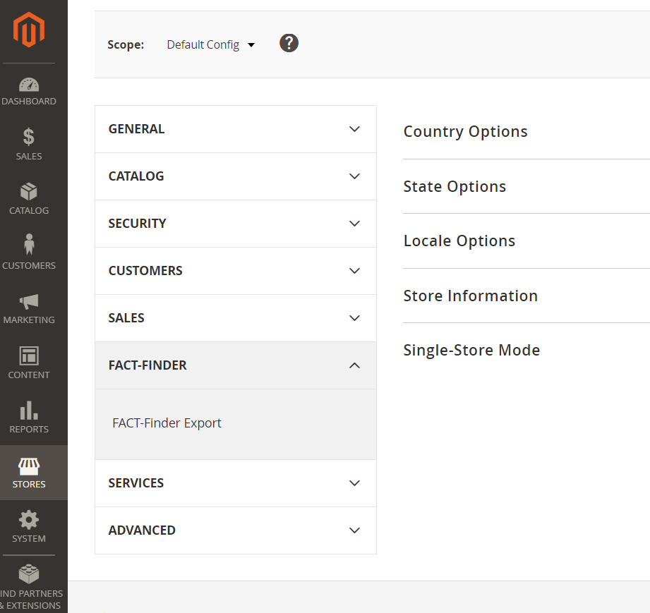
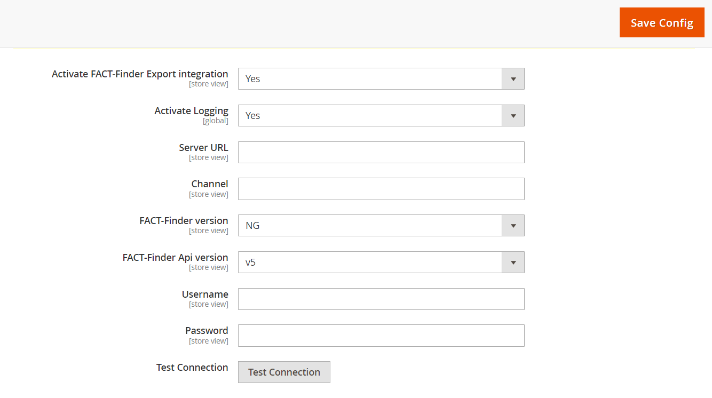
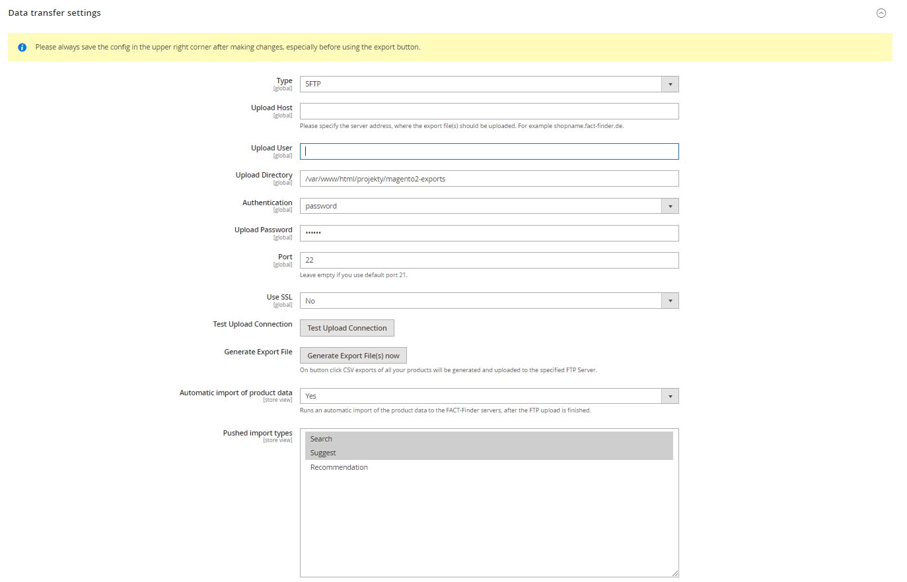
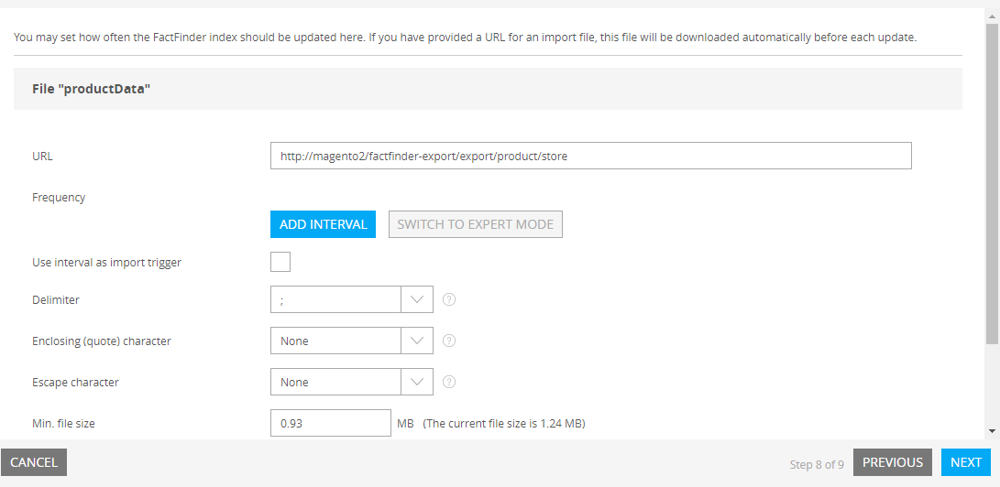

# FACT-Finder® Export for Magento 2
This module will provide FACT-Finder® export functionality for Magento2

[](https://github.com/FACT-Finder-Web-Components/magento2-module/actions)

This document helps you integrate the FACT-Finder export SDK into your Magento 2 Shop. In addition, it gives a
concise overview of its primary functions. The first chapter *Installation* walks you through the suggested installation
processes. The second chapter “Backend Configuration” explains the customisation options in the Magento 2 backend. The
final chapter.

## Table of contents
- [Requirements](#requirements)
- [Installation](#installation)
- [Activating the Module](#activating-the-module)
- [Backend Configuration](#backend-configuration)
    - [Main Settings](#main-settings)
        - [FACT-Finder version](#fact-finder-version)
    - [Export Settings](#export-settings)
    - [CMS Export Settings](#cms-export-settings)
    - [Data Transfer Settings](#data-transfer-settings)
        - [Automatic Import](#automatic-import)
- [Data Export](#data-export)
    - [Feed Types](#feed-types)
    - [Integration Methods](#integration-methods)
        - [FTP Export](#ftp-export)
        - [HTTP Export](#http-export)
    - [Console Command](#console-command)
- [Modification examples](#modification-examples)
    - [Changing existing column names](#changing-existing-column-names)
    - [Adding new column](#adding-new-column)
        - [GenericField usage](#genericfield-usage)
    - [Adding custom product data provider](#adding-custom-product-data-provider)
    - [Configure field to be exported from variant](#configure-field-to-be-exported-from-variant)
- [Troubleshooting](#troubleshooting)
    - [Removing `/pub` from exported URLs](#removing-pub-from-exported-urls)
- [Contribute](#contribute)
- [License](#license)

## Requirements

This module supports:

- Magento 2 version 2.4 and higher
- PHP version 8.1 and higher

## Installation

To install module, open your terminal and run the command:

    composer require factfinder/magento2-exportmodule

Optionally, you can specify a version constraint, e.g. `factfinder/magento2-exportmodule:^1.0`. Refer to Composer manual
for more information. If, for some reason, `composer` is not available globally, proceed to install it following the
instructions available on the [project website](https://getcomposer.org/doc/00-intro.md).

## Activating the Module

From the root of your Magento 2 installation, enter these commands in sequence:

    php bin/magento module:enable Factfinder_Export
    php bin/magento setup:upgrade

As a final step, check the module activation by running:

    php bin/magento module:status

The module should now appear in the upper list: *List of enabled modules*.

Also, check in the Magento 2 backend "Stores → Configuration → Fact-Finder" if the module output is activated.



## Backend Configuration

Once the FACT-Finder module is activated, you can find the configurations page under "Stores → Configuration → Fact-Finder -> FACT-Finder Export". Here you can customise the connection to the FACT-Finder service. You can also activate and deactivate module, as well as access many additional export settings.

### Main Settings

At the top of the configurations page are the main settings. The information with which the shop connects to and authorises itself to the FACT-Finder Service are entered here. In the first line, activate your FACT-Finder integration. Before any changes become active, save them by clicking "Save Config".
In some cases, you need to manually empty the cache (*Configuration* and *Page Cache*).
Click the button "Test Connection" to check the connection to the FACT-Finder service.

**Note:** the channel name needs to be entered correctly to establish a connection.

By enabling option *Activate Logging*, all exceptions thrown during communication with FACT-Finder server will be saved in log file `var/log/factfinder.log`.



#### FACT-Finder version
The module supports both `7.3` and `NG`. If you use lower version, you could install [NG submodule,](https://github.com/FACT-Finder-Web-Components/magento2-ffng-module) but it is deprecated module, and it is not recommended to use it.

### Export Settings


In this section users can decide if the attributes should be exported as single fields or grouped into a multi-attribute field.
Setting Multi-Attribute to No will result attribute being part of cumulative column FilterAttribute.
Setting value to Yes will result attribute will be exported into separated column.

Attribute export is working for the attributes of type:
- boolean
- price
- select
- multiselect
- all scalars

#### Numerical attributes

Setting a multi-attribute field as numerical, will cause this field to be exported to a separate multi-attribute column named `NumericalAttributes`.
This would easier filter configuration in FACT-Finder.

**Note:** Attributes which are part of configuration are always exported to `FilterAttributes`.

### CMS Export Settings

You can export Your CMS pages to FACT-Finder to present them in suggest results.


- **Pages Blacklist** - allow user to filter out pages, which should not be exported, for example "404 Not Found page"
  should not be visible at suggested records

If you want to start using CMS export in your project, please contact a person from FACT-Finder who is assigned to your project or ask our Service Desk.

**Note:** CMS Export is available only via [console command](#console-command)

### Data Transfer Settings
This option configures the connection with the FACT-Finder system via FTP/SFTP. Shop data can be generated and transferred to
FACT-Finder using FTP/SFTP. FACT-Finder needs to be up-to-date on the product data, to ensure that components like the search work as intended.

For FTP servers you will likely specify the user and password
For SFTP servers you can use both authentication methods: key or password

**Note** Magento uploader does not allow files without extension. If your key file doesn't have any, please add one (for example .rsa)
**Note** Don't forget to specify the key passphrase if it's protected

Enter a server to which the CSV file is uploaded automatically. If you are not sure if Magento will be able to connect to your server, please use "Test Upload connection" option.

The CSV file uses double quotes `"` for field enclosure and a semi-colon `;` as field delimiter.

Before starting the export by clicking *Generate Export File(s) now*, you need to commit all changes by clicking "Save Config".
The exception to that rule is `Test Connection` function which always takes the actual values from the corresponding fields.



#### Automatic Import
Once the feed file is uploaded (using [FTP Export](#ftp-export)), in order FACT-Finder to start serving new data, import needs to be triggered. Module allows You to enable automatic import which makes FACT-Finder import will be triggered, right after the feed file is uploaded onto FTP server. You can also select which of data types should be imported automatically
- Search
- Suggest
- Recommendation

This is a multiselect field, so You can select all of them

## Data Export
In following section You'll get information how, to integrate Your feed with FACT-Finder. Feed is built the same way, regardless of chosen method, so You can choose from one of possible methods.

### Feed Types
Module is capable of exporting feeds in one of the following types
- Product
- CMS

Product is the main feed that will be used by FACT-Finder to produce search result for your shop.
CMS could be used as a separate search result source (if you have search functionality in your website) or to enrich suggestions (if you want to suggest blog articles related to user search query).

### Integration Methods
#### FTP export
This method exports feed from shop system and uploads it to FTP server. In order to use this method of export, You need to have FTP server configured (described in section [Data Transfer Settings](#data-transfer-settings)).
Then You can click the button (visible below) to generate and then, upload file via FTP.

 now")

Using of that button is dedicated mostly for ad-hoc export. In production environment You'll rather use Cron job which will do the same work without forcing You to click the export button each time You want to send new data to FACT-Finder.
To configure Cron, please activate the option *Generate Export Files(s) automatically* and the export will be generated according to cron export settings

You can define your own cron expression in the module configuration (section visible below).
Please remember that this setting is only for that specific task ran under Magento supervisor. It won't work until You have no system Cron configured. To do that, You'll need to add Magento Cron entrypoint to Your system crontab file.
Read this [tutorial](https://devdocs.magento.com/guides/v2.4/config-guide/cli/config-cli-subcommands-cron.html) for more information


#### HTTP Export

Alternative way to integrate Your feed is to use builtin FACT-Finder functionality to periodically download feed from specific URL which the feed is accessible at. This URL should be secured by Basic Auth (username and password configured at section HTTP Export) in order only authenticated users get access to. By making this URL no secured, You are allowing literally everyone to download Your feed!


Exports are available under following location: `https://YOUR_SHOP_URL/factfinder-export/export/product/store/YOUR_STORE_ID`

If there's no `store id` provided, feed will be generated with the default store (by default with id = 1)

You should provide this URL in Your FACT-Finder UI


### Console Command
If You are a developer and want to test feed is generated correctly, or You do not want to execute magento cron You can use console command which is implementation of Command of Symfony Console Component, builtin in Magento2.
Command name: `factfinderexport:export [TYPE]`. You can add execution of this command to Your crontab file.
- Arguments:
    - type (mandatory) - set the `FeedFactory` class with a type of data to be exported. If for a given type, no data provider exists, an exception will be thrown. Possible default values are `product` and `cms`.
- Options (all optional)
    - --store - define a store, which the product data will be taken from
    - --upload - upload generated file to server via FTP/SFTP connection
    - --push-import - triggering import in Fact-Finder system

## Modification examples
Our Magento 2 module offers a fully working integration out of the box. However, most projects may require
modifications in order to fit their needs. Here are some common customization examples.

### Changing existing column names
The module has predefined column names defined in the main DI configuration `etc/di.xml`. These follow our feed best practices. The default DataProvider is configured to export data for columns with same names, so in order to change column name, you will need to add two modifications:

* Define new column name in your custom module `di.xml`. The following code snippet shows how to change name for column Master Product Number (in module named `Master`):

```xml
<virtualType name="Factfinder\Export\Model\Export\CatalogFeed">
    <arguments>
        <argument name="columns" xsi:type="array">
            <item name="Master" xsi:type="string">CUSTOM_NAME</item>
        </argument>
    </arguments>
</virtualType>
```

* Once the column name is changed in `di.xml`, add a plugin to the DataProvider and replace the standard name with new one. Remember that you do not need to copy rest of elements. They won't be removed because the DI configuration loading mechanism will merge all definitions into one output. Example implementation:

```xml
<type name="Factfinder\Export\Model\Export\Catalog\ProductType\SimpleDataProvider">
    <plugin name="custom-provider" type="YOUR_VENDOR\YOUR_MODULE\Plugin\AfterToArrayPlugin" />
</type>
```

```php
public function afterToArray($subject, $result)
{
    return ['CUSTOM_NAME' => $result['Master']] + $result;
}
```

Finally, run `bin/magento cache:clean config` to replace old DI configuration with the one you just created.

### Adding new column
The standard feed contains all data FACT-Finder® requires to work. However, you may want to export additional information which is relevant for your project and not part of a default Magento 2 installation. In order to do so, let's take a look into the FieldProvider definition:

 ```xml
<type name="Factfinder\Export\Model\Export\Catalog\FieldProvider">
     <arguments>
         <argument name="productFields" xsi:type="array">
             <item name="ImageURL" xsi:type="object">Factfinder\Export\Model\Export\Catalog\ProductField\ProductImage</item>
             <item name="CategoryPath" xsi:type="object">Factfinder\Export\Model\Export\Catalog\ProductField\CategoryPath</item>
             <item name="Attributes" xsi:type="object">Factfinder\Export\Model\Export\Catalog\ProductField\Attributes</item>
         </argument>
     </arguments>
 </type>
 ```

The constructor argument `productFields` stores reference to fields that require more logic than simply retrieving data from the product. Let's assume we want to add a new column `BrandLogo` containing image URLs. In your module DI, add the new field definition in the same way as defaults are added.

Again, there is no need to copy all other field definitions: Magento will merge the existing columns with the one you just have added. In order for your field exporter to work, it has to implement `Factfinder\Export\Api\Export\FieldInterface`. Your class skeleton to export the brand logo could look like this:

```php
class BrandLogo implements \Factfinder\Export\Api\Export\FieldInterface
{
    public function getValue(Product $product): string
    {
        // Getting products brand logo URL...
    }
}
```

Finally, You need to define new column in CatalogFeed definition in di.xml`.

```xml
<virtualType name="Factfinder\Export\Model\Export\CatalogFeed">
    <arguments>
        <argument name="columns" xsi:type="array">
            <item name="BrandLogo" xsi:type="string">BrandLogo</item>
        </argument>
    </arguments>
</virtualType>
```

#### GenericField usage
If extracting logic is just a retrieving attribute value from product without any further data transformation creating virtual type of *GenericField* might be used instead of implementing *FieldInterface*. The constructor for this class requires only an attribute code to be exported.
```xml
<virtualType name="Factfinder\Export\Model\Export\Catalog\ProductField\Brand" type="Factfinder\Export\Model\Export\Catalog\ProductField\GenericField">
    <arguments>
        <argument name="attributeCode" xsi:type="string">manufacturer</argument>
    </arguments>
</virtualType>
``` 

Now run `bin/magento cache:clean config` to use the new DI configuration.

### Adding custom product data provider
If You are in need to define new product types, and its data cannot be provided by any of existing Data Providers, You should create a custom Data Provider and map it to Your product type. This operation like previous are available via Magento DI mechanism. In your module DI add following xml code

```xml
    <type name="Factfinder\Export\Model\Export\Catalog\DataProvider">
        <arguments>
            <argument name="entityTypes" xsi:type="array">
                <item name="customProductType" xsi:type="string">YOUR_VENDOR\YOUR_MODULE\Model\Export\Catalog\ProductType\CustomDataProvider</item>
            </argument>
        </arguments>
    </type>
```

```php
<?php
class CustomDataProvider implements DataProviderInterface
{
    /** @var Product */
    protected $product;

    public function __construct(Product $product)
    {
        $this->product = $product;
    }

    /**
     * @inheritdoc
     */
    public function getEntities(): iterable
    {
        // Your logic
    }
}
```

It's a minimum configuration. `$product` constructor will be passed automatically and in method `getEntities` You should extract all required data

### Configure field to be exported from variant
By default, module exports data from configurable product. Its variants override only few of fields which you can see in class:

    src/Model/Export/Catalog/Entity/ProductVariation.php

This is done to provide the best performance but if your variants differs in some attributes other than configurable attributes (color, size etc.) You can configure which fields should be exported from variants. Use `variantFields` argument for that.
Here is the example from module, where we want to export `ImageURL` from variants because some configurable attribute could have an impact on how product looks (color is a good example).
```xml
<type name="Factfinder\Export\Model\Export\Catalog\FieldProvider">
    <arguments>
        <argument name="productFields" xsi:type="array">
            <item name="CategoryPath" xsi:type="object">Factfinder\Export\Model\Export\Catalog\ProductField\CategoryPath</item>
            <item name="Brand" xsi:type="object">Factfinder\Export\Model\Export\Catalog\ProductField\Brand</item>
            <item name="FilterAttributes" xsi:type="object">Factfinder\Export\Model\Export\Catalog\ProductField\FilterAttributes</item>
        </argument>
        <argument name="variantFields" xsi:type="array">
            <item name="ImageURL" xsi:type="object">Factfinder\Export\Model\Export\Catalog\ProductField\ProductImage</item>
        </argument>
    </arguments>
</type>
```

## Troubleshooting

### Removing `/pub` from exported URLs
If the exported feed file contains URLs with `pub/` added, most probably your document root is set to the `/pub` folder. In order to skip this part in URL, please add following entry to your project's `env.php` file:
```php
'directories' => [
    'document_root_is_pub' => true
],
``` 

## Contribute
For more information, click [here](.github/CONTRIBUTING.md)

You can also open a new issue if You spot a bug or just have an idea for module improvement
To check currently opened issues [here](https://github.com/FACT-Finder-Web-Components/magento2-export-module/issues).

## License
FACT-Finder® Web Components License. For more information see the [LICENSE](LICENSE) file.

